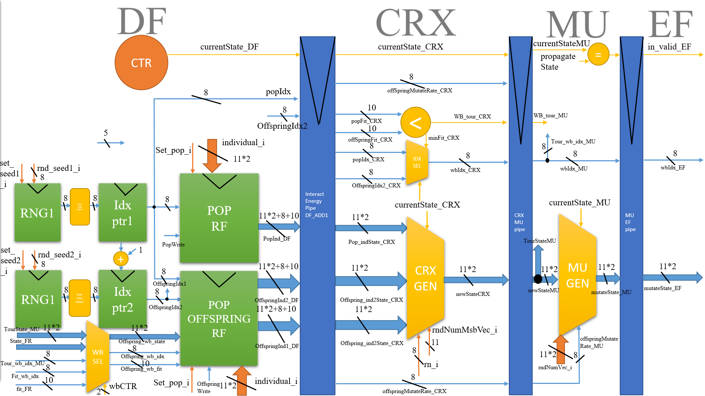

# POP_RF
1. Perform TOUR / CrossOver->Mutation and Evaluate fitness in a pipeline manner.
2. The tournament stage would share the data path with CrossOver mutate and evaluate fitness
3. TOUR result got written back at MU stage from the CRX/MU pipeline register back to POP_Offspring_rf

# DATAPATH

 

# LOG
[Update and maintainance log for POP_RF](log.md)