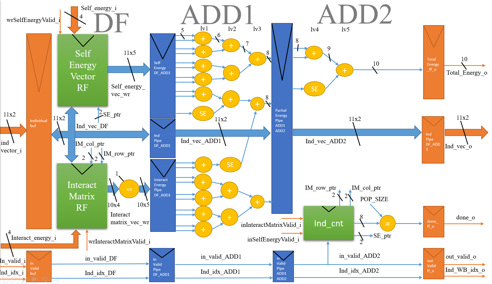

# Evaluation Fitness
0. Let L be lattice Length, P be population size, N be number of particles, individual is of $[x_0,x_1,x_2,....]$ where x_i $\isin (0,1,2)$
1. My design aims to reduce the time Complexity of software sequential model of $\Theta(LP)$ to $\Theta(P)$ using pipeline.
2. Then if cache is implemented, the ideal case can further improve the algorithm time complexity to somewhere between $O(P)$ and $\Omega(1)$
3. This module does not need any controlpath.

# Algorithm
```C
   const int LatticeLength = 11;
   int totalEnergy = 0;
   int interactionMatrix[3][3] = interaction_in[3][3];
   int selfEnergyVector[1][3] = selfEnergyVector_in[1][3];

   for(int i = 0 ; i < LatticeLength ; i = i + 1)
   {
        totalEnergy += selfEnergyVector[i];
        if(i < 10) totalEnergy += interactionMatrix[i][i+1] * 2;
   }

   return totalEnergy
```

# Datapath
## Main datapath



# Testbench
