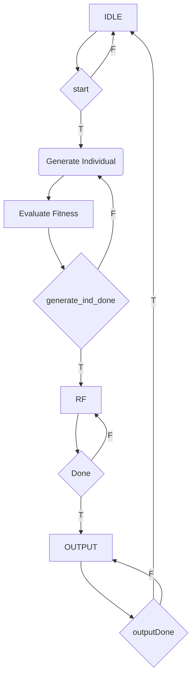

# EC_FINAL_PROJECT

1. Change the self mutate rate into int8 instead of using fix or floating point values.
2. Change the normal distribution into Discrete Binomial distribution and implement it using LUT.
3.

