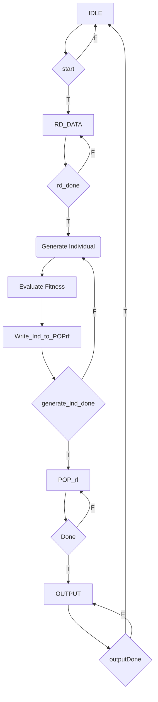
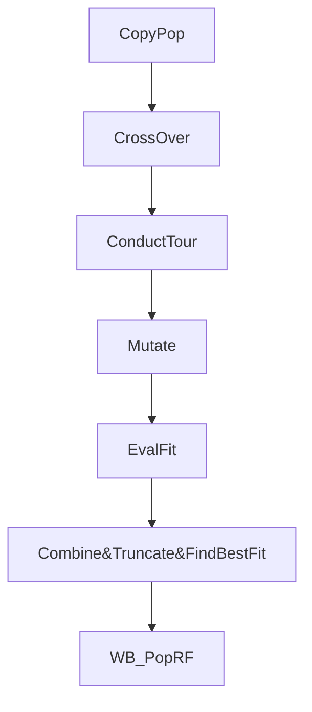

# EC_FINAL_PROJECT

1. Change the self mutate rate into int8 instead of using fix or floating point values.
2. Change the normal distribution into Discrete Binomial distribution and implement it using LUT.
3. Dividing Evaluate Fitness Module into N-stage Pipelines, propagate out_valid and use it as in_valid for POP_rf write back signal.
4. In evaluate fitness module, WB to POP_rf in negedge clk.

## POPrf
